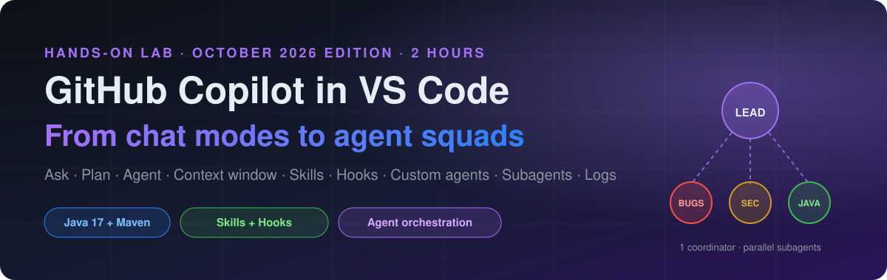
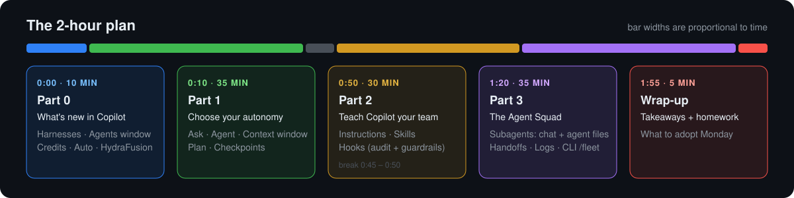
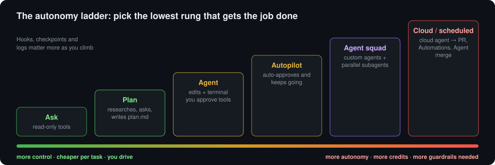
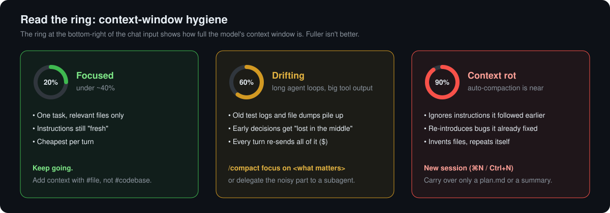
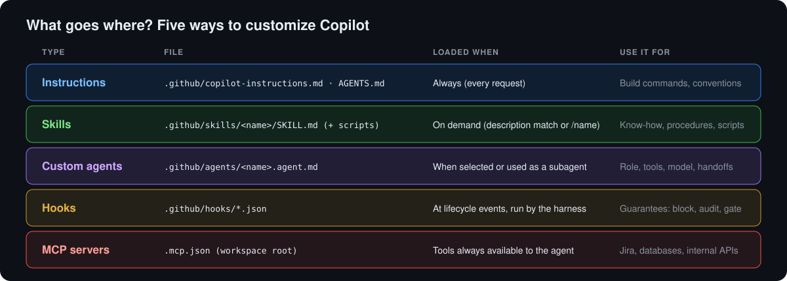
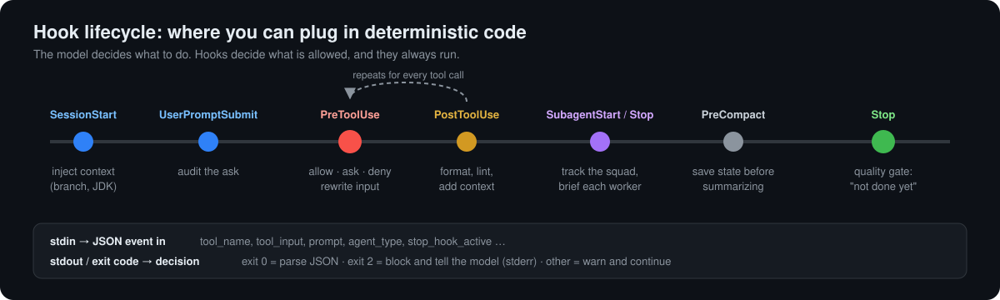
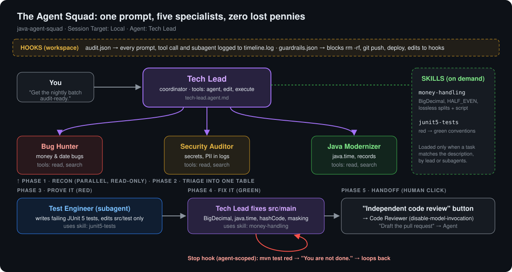

<p align="center">
  
</p>

# 🎓 Student Handout: GitHub Copilot in VS Code (October 2026 Edition)

> [!IMPORTANT]
> **Before class:** update to **VS Code 1.140 or later** (released **September 30, 2026**). VS Code now ships **weekly**, so *Help → Check for Updates* the morning of class.
> You also need **JDK 17+**, **Maven 3.9+**, **Git**, and a signed-in **GitHub Copilot** subscription.
> Warm your Maven cache once so builds don't download during class: run `mvn -q test` inside the `java-agent-squad` folder.

> [!TIP]
> **📘 Companion: the [Copilot Field Guide](https://varoonsahgal.github.io/ghcp-webinar/field-guide/)** explains every concept in this lab in more depth, with analogies, diagrams and a searchable glossary. Keep it open beside the handout. (Source: [`field-guide/`](field-guide/).)

### ☕ Before class: install Java and Maven

You need Java from **Part 1, Step 2** onward, so set it up before class. First check what you already have. Open a terminal **inside VS Code** (`` Ctrl+` ``) and run:

```bash
java -version
mvn -v
```

You're done if `java -version` reports **17 or higher** and `mvn -v` reports **Maven 3.9+** with a Java version line of 17 or higher. If not, follow the steps for your OS, or skip to [Let Copilot do it](#let-copilot-do-it).

> [!NOTE]
> On a **company-managed laptop**, installs may be blocked. Request a JDK 21 and Maven from your software portal or IT team instead.

<details>
<summary><b>🍎 macOS (Homebrew)</b></summary>

1. If you don't have Homebrew, install it from [brew.sh](https://brew.sh), then follow the "Next steps" it prints to add `brew` to your `PATH`.
2. Install the JDK (Eclipse Temurin 21) and Maven:

   ```bash
   brew install --cask temurin@21
   brew install maven
   ```

3. Point `JAVA_HOME` at JDK 21 so Maven uses it:

   ```bash
   echo 'export JAVA_HOME=$(/usr/libexec/java_home -v 21)' >> ~/.zshrc
   source ~/.zshrc
   ```

4. **Fully quit and reopen VS Code** (`Cmd+Q`) so its terminal picks up the change, then run `java -version` and `mvn -v` again.

</details>

<details>
<summary><b>🪟 Windows (PowerShell)</b></summary>

1. Install the JDK (Eclipse Temurin 21) with winget:

   ```powershell
   winget install --id EclipseAdoptium.Temurin.21.JDK -e
   ```

   No winget? Download the **JDK 21 `.msi`** from [adoptium.net](https://adoptium.net/temurin/releases/?version=21). In the installer, set **"Set JAVA_HOME variable"** to *Will be installed on local hard drive*.

2. Set `JAVA_HOME` (skip this if the installer already did) by running this in a **new** PowerShell window:

   ```powershell
   $jdk = (Get-ChildItem "C:\Program Files\Eclipse Adoptium" -Directory | Where-Object Name -like "jdk-21*" | Select-Object -First 1).FullName
   [Environment]::SetEnvironmentVariable("JAVA_HOME", $jdk, "User")
   ```

3. Install Maven. It's a zip file you unpack and add to your `PATH`, with no admin rights needed:

   ```powershell
   $v = "3.9.16"
   $zip = "$env:TEMP\maven.zip"
   Invoke-WebRequest "https://archive.apache.org/dist/maven/maven-3/$v/binaries/apache-maven-$v-bin.zip" -OutFile $zip
   Expand-Archive $zip -DestinationPath "$env:USERPROFILE\tools" -Force
   $mvnBin = "$env:USERPROFILE\tools\apache-maven-$v\bin"
   $userPath = [Environment]::GetEnvironmentVariable("Path", "User")
   if ($userPath -notlike "*$mvnBin*") { [Environment]::SetEnvironmentVariable("Path", "$userPath;$mvnBin", "User") }
   ```

   If you use Chocolatey or Scoop, `choco install maven` or `scoop install maven` works too.

4. **Fully close every VS Code window and reopen it** so the terminal picks up the new variables, then run `java -version` and `mvn -v` again.

</details>

#### Let Copilot do it

Prefer not to type the commands yourself? Open any folder in VS Code, open Chat, pick the **Agent** agent with **Default Approvals**, and paste this prompt. Read each command before you approve it.

```text
Set up this machine for a Java lab. I need JDK 17 or newer (prefer Eclipse Temurin 21) and Apache Maven 3.9 or newer, working in VS Code's integrated terminal.

1. Detect my OS (macOS or Windows) and shell, then run `java -version` and `mvn -v` and tell me what's already installed. If both are already correct (Java 17+ and Maven 3.9+, with Maven's "Java version" line also 17+), stop and say so.
2. Show me your plan before installing anything. Use the standard package manager for my OS:
   - macOS: Homebrew (`brew install --cask temurin@21` and `brew install maven`). If Homebrew is missing, stop and tell me to install it from brew.sh rather than installing it yourself.
   - Windows: winget for the JDK (`winget install --id EclipseAdoptium.Temurin.21.JDK -e`). For Maven, use Chocolatey or Scoop only if one is already installed. Otherwise download the official binary zip from archive.apache.org/dist/maven/maven-3/, unpack it under %USERPROFILE%\tools, and add its bin folder to my User PATH. Don't require admin rights.
3. Set JAVA_HOME persistently to the JDK 21 install (macOS: append to ~/.zshrc using /usr/libexec/java_home -v 21; Windows: User environment variable). Don't remove or reorder anything already on my PATH.
4. Don't use sudo, and don't uninstall or change any other JDKs I have. If something fails because of permissions or a company policy, stop and explain what to ask IT for.
5. Verify in a fresh shell that `java -version` and `mvn -v` show the right versions. If the lab's java-agent-squad folder is on this machine, run `mvn -q test` in it to warm the Maven cache.
6. Finish with a short summary of what you installed and changed, and remind me to fully restart VS Code.
```

> [!TIP]
> If `mvn -v` still shows an old Java version after a restart, `JAVA_HOME` is pointing at the old JDK. Ask Copilot: `#terminalSelection why is Maven using this Java version?`

<p align="center"></p>

**By the end of today you will be able to:**

* 🧭 Pick the right **agent, harness and model** for a task, and explain what it costs under **AI Credits**
* 🗣️🧭🤖 Drive **Ask → Plan → Agent**, steer it mid-flight, and undo it with **checkpoints**
* 🔵 Read the **context window** ring, spot **context rot**, and fix it with `/compact`, new sessions and subagents
* 🧩 Package team know-how as an **Agent Skill**
* 🪝 Enforce rules the model can't talk its way around, using **Hooks**
* 👥 Spin up **subagents from the chat box**, then orchestrate a **squad of custom agents**, and prove what happened with **agent logs**

---

## 🆕 Part 0: What's changed in the last 6 months (10 min)

<p align="center"></p>

Copilot has changed more in the last six months than in the year before. Here's what's different:

| | ~6 months ago | **Now (October 2026)** |
|---|---|---|
| **Release cadence** | Monthly | **Weekly** (1.136 → 1.140 shipped in September alone) |
| **Edit mode** | Deprecated | **Removed** in 1.126 (June 2026). Use **Agent** or a custom agent. |
| **Billing** | Premium requests, "0x" models | **GitHub AI Credits**, billed by tokens at each model's rate (since **June 1, 2026**) |
| **Model picking** | Pick a model | **Auto** with an *Optimize for* setting (Efficiency / Balance / Intelligence). Auto is **10% cheaper** than picking the same model directly. **HydraFusion** (research preview) mixes models for you. |
| **Where agents run** | Chat view | Chat view **+ Agents window** (`code --agents`), plus a **Session Target** picker: **Local**, **Copilot**, **Claude**, **Codex** or **Cloud** |
| **Customization** | Custom agents (ex-"chat modes") | **Agent Customizations editor**, plus **Agent Skills**, **Hooks** and **plugins** |
| **Observability** | Chat Debug view | **Agent Debug Log panel** with an **Agent Flow Chart**, a **Summary** view and `/troubleshoot` |
| **Terminal** | Copilot CLI (early) | **Copilot CLI** with `/fleet` (parallel subagents), `/delegate`, custom agents, skills and hooks |

### 🧠 The new mental model: *harness × agent × model*

<table>
<tr>
<td width="50%"></td>
<td>

* **Harness (Session Target):** the engine that runs the agent loop, applies permissions and calls tools.
  * **Local** is VS Code's built-in harness. **We use Local today.**
  * **Copilot** is the Copilot SDK runtime shared with Copilot CLI and the GitHub Copilot app.
  * **Claude** and **Codex** are the vendors' own harnesses. **Cloud** runs remotely and delivers a PR.
* **Agent** is the role: *Ask, Plan, Agent*, or your own custom agent.
* **Model** is the brain: a specific model, *Auto*, or *HydraFusion*.

</td>
</tr>
</table>

> [!NOTE]
> Changing the **model** does not change the **harness**. Hooks, tool names and some customization features are **harness-specific**. That's why today's lab pins **Session Target → Local**.

### 💳 What things cost now

<table>
<tr>
<td width="42%"></td>
<td width="30%"></td>
<td>

* Click the **context usage indicator** in the chat input to see **Session Cost** in credits.
* **Tokens are the cost driver.** Long agent loops, big contexts and subagents all add up.
* Use **Auto** (10% discount), and set *Optimize for → Efficiency* for routine work.

</td>
</tr>
</table>

> [!TIP]
> **The old "use a 0x model" trick is gone.** Under AI Credits, the levers are a **cheaper model or Auto**, **fewer and tighter prompts**, and **smaller context** (`/compact`, and new sessions for new tasks).

### 🪟 Meet the Agents window


Open it with **Open in Agents** in the title bar, or run `code --agents`. It's built for **assigning and reviewing** work across many sessions: worktrees, Dev Containers, **Automations** (scheduled prompts), **Create PR** and the experimental **Agent merge**. Sessions are shared with the regular Chat view.

---

## 🟩 Part 1: Choose your autonomy (35 min)

<p align="center"></p>

You'll build and evolve a **Java weather app** while learning **how much autonomy each task deserves**.

### 🛠️ Setup

1. Create and open an empty folder called `copilotexplore` in VS Code.
2. Open Chat (`⌃⌘I` / `Ctrl+Alt+I`). In the chat input, set:
   * **Session Target → Local**
   * **Model → Auto** (*Optimize for: Efficiency*), or any small, fast model your org allows
   * **Permissions → Default Approvals**


---

### 🟦 Step 1: Ask, scaffolding a project

> 🗣️ **Agent:** Ask  🎯 **Goal:** scaffold with minimal autonomy

```text
/new scaffold a new Maven project in Java 17 that prints the current weather for a city passed on the command line
```

`/new` scaffolds a workspace from a natural-language description and **lets you preview it before creating anything**.

**👀 What to observe**
* Copilot proposes a file tree, dependencies and starter code, all in **one bounded pass**.
* Nothing self-corrects or loops. That's the point.

#### Ask is "just" a custom agent

Open the **agents dropdown** in the chat input, hover **Ask**, and open its definition. You can also type `/agents`.
Notice it describes itself as an agent (*"You are an ASK AGENT…"*) and has **read-only tools** only.

<table><tr>
<td></td>
<td></td>
</tr></table>

> [!NOTE]
> **Mental model:** built-in agents (Ask, Plan, Agent) are **examples**. Custom agents are how you build your own. Edit mode was removed for exactly this reason: if you want a "constrained editor", write a custom agent with the tools you want.

---

### 🟥 Step 2: Debugging with precise context

1. Run the app. If it needs an API key, ask in **Ask**: `Is there a better alternative that does not require an API key?` and choose **wttr.in**, so we're all on the same page.
2. If it runs perfectly, **break it on purpose**: rename a method or remove an import.
3. Highlight the error in the terminal, then ask:

```text
#terminalSelection how do I fix this error?
```

`#terminalSelection` injects the **exact** terminal output. Type `#` to browse other context items: `#problems`, `#changes`, `#<file>`, `#<symbol>`, or a pasted GitHub issue or PR URL.

> [!TIP]
> **Precise context often matters more than switching agents.** Ask plus great context is extremely powerful.

**Don't forget inline chat.** For a one-spot fix, select the code and press `⌘I` / `Ctrl+I`. It's the smallest, cheapest context there is.


---

### ⚠️ Discussion: is Agent overkill?

Under **AI Credits** you pay for **tokens**, not prompts. That changes the old answer:

* 🤖 An **Agent** turn may run 10–40 tool calls, re-reading files and test output each time. **Many more tokens.**
* 🗣️ An **Ask** turn that answers in one shot uses a fraction of that.
* So Ask can now be **genuinely cheaper**, not just "fewer prompts". Check **Session Cost** after each step and compare.

> [!IMPORTANT]
> **More autonomy is not always better.** Choosing the lowest rung on the ladder that gets the job done *is* the skill.

---

### 🟨 Step 3: Agent, scoped changes

> 🤖 **Agent:** Agent  🎯 **Goal:** let Copilot edit files and run commands, with you approving

```text
I want to add a web view to my Java weather application. Edit the files and do that for me.
```

**👀 What to observe**
* Unlike Ask, Agent **edits files directly** and **iterates**.
* Terminal commands come with an **AI risk assessment** before you approve them:


---

### 🟥 Step 4: Agent, autonomous multi-step work, and steering

```text
In this weather app, I want you to:
1. Add a forecast section showing upcoming weather for the next 5 days.
2. Add a temperature unit toggle that switches between Celsius and Fahrenheit.
```

**While it's working, steer it.** Type a follow-up and open the **Send** dropdown:


```text
Make Celsius the default and remember the user's choice.
```

**👀 What to observe**
* A **todo list** appears and is ticked off.
* It runs the build, reads the errors, **fixes its own mistakes**, and loops until done.
* **Steer** injects your message mid-run. **Queue** waits for the current turn.

> [!TIP]
> Agent behaves like a **fast junior engineer**: productive, but it needs oversight. Parts 2 and 3 are about *encoding* that oversight.

---

### 🔵 Step 5: The context window, the little ring that matters

> 🎯 **Goal:** see what the agent is "holding in its head", and why a fuller window gives *worse* results

You've just finished a long agent loop (Step 4). Look at the **bottom-right corner of the chat input**. That small ring with a percentage is the **context window control**. Hover or click it:

<p align="center"></p>

| In the popup | What it tells you |
|---|---|
| **Session Cost** | AI Credits this session has spent so far |
| **Context Window** `26.1K / 1M tokens` | How much of the model's window **this request** uses. The shaded part is reserved for the response. |
| **System**: Instructions, Tool Definitions | Fixed overhead. Every enabled tool and MCP server costs tokens on *every* turn. |
| **User Context**: Messages, Tool Results | The part that grows. In agent loops **Tool Results** (file reads, test logs, terminal output) usually dominate. |
| **Compact Conversation** | Summarizes older history to free up space |

#### What actually goes into the window

<p align="center"></p>

All of this is re-sent to the model **on every turn** (prompt caching softens the cost, but not the confusion).

#### 🧟 Context rot: why "more context" isn't "better context"

Models don't treat token #100,000 as reliably as token #100. **Context rot** is the measurable drop in quality as input grows. In [Chroma's study of 18 frontier models](https://research.trychroma.com/context-rot), **every model degraded as input length increased**, even on trivially simple tasks:

<p align="center"><br/><sub>Source: Chroma, <i>Context Rot: How Increasing Input Tokens Impacts LLM Performance</i> (<a href="https://github.com/chroma-core/context-rot">github.com/chroma-core/context-rot</a>)</sub></p>

Why it happens:
* **Lost in the middle.** Information at the start and end of the context is used better than information buried in the middle. In a long session, your early instructions *are* the middle.
* **Distractors.** Similar-but-wrong content (old stack traces, the *previous* version of a file) actively misleads the model.
* **Reasoning degrades too.** Even when the model can find the right fact, its reasoning over long inputs gets worse.

**What context rot looks like in Copilot:** it forgets a rule it followed an hour ago, re-introduces a bug it already fixed, re-reads the same files, contradicts its own plan, or invents a file name.

> [!IMPORTANT]
> A **1M-token window is capacity, not a target.** Today's models can hold your whole repo; that doesn't mean they reason well over it. And under AI Credits you pay for those tokens on every turn.

<p align="center"></p>

<sub>The 40% and 60% thresholds are a rule of thumb, not an official limit. Watch the *behavior*, not just the number.</sub>

#### 🧹 Context hygiene toolkit

| Move | When | How |
|---|---|---|
| **Add precise context** | Always | `#file`, `#symbol`, `#terminalSelection` instead of "look at everything" |
| **Compact** | Ring is filling up but the task isn't done | `/compact focus on the forecast feature decisions`, or the **Compact Conversation** button. VS Code also auto-compacts near the limit. |
| **New session** | New task, or rot symptoms | `⌘N` / `Ctrl+N`. Carry over a plan file or a 5-line summary, not the whole chat. |
| **Fork** | Want to try an alternative without polluting the main thread | `/fork`, or **Fork Conversation** on a checkpoint |
| **Side chat** | Quick question about a response | Select text in a response → **Ask Question** (Agents window) |
| **Subagent** | Noisy research, log reading or review | Work happens in the subagent's **own** context; only the summary comes back (see Part 3) |
| **Instructions, not chat** | A rule that must survive | Put it in `copilot-instructions.md` or a skill, not in message #3 of a long chat |

<table><tr>
<td width="50%"><br/><sub><b>Side chat:</b> ask about a response without growing the main context</sub></td>
<td><br/><sub><b>Fork:</b> branch from any checkpoint to explore an alternative</sub></td>
</tr></table>

**🧪 Try it (3 min)**
1. Hover the ring and note the **%**, the **Session Cost**, and which category is largest.
2. Run `/compact keep only the decisions about units and the forecast API` and watch the % drop.
3. Ask: `What did we decide about the default temperature unit, and why?` Did the summary keep it? If not, that decision belongs in `copilot-instructions.md`.

> [!TIP]
> For the full picture of what was sent, use the **Chat Debug view** (`/debug`). The **Cache Explorer** shows how much of each request was a cheap cache hit. Both are covered in Part 3.

---

### 🟪 Step 6: Plan, design before execution

> 🧭 **Agent:** Plan  🎯 **Goal:** structured research and clarifying questions before code

```text
/plan I want to see a detailed hourly weather overview when I click on a day in the 5-day forecast
```

**👀 What to observe**
* Plan **researches the codebase** and **asks clarifying questions** (granularity? which API endpoint?).
* It produces a plan with steps, files and verification. It's stored in session memory; run **Chat: Show Memory Files** and open `plan.md`.
* Then choose: **Implement** (normal approvals) or **Start with Autopilot** (Preview), which auto-approves tools and keeps going.

<p align="center"><br/><sub>A plan file is <b>externalized memory</b>: it survives compaction and new sessions. (From the VS Code context engineering guide.)</sub></p>

> [!WARNING]
> **Approving a plan ≠ approving tool actions.** Autopilot auto-approves edits *and* terminal commands. Your org can disable it. Use it only where hooks and checkpoints have your back.

#### 💎→🪙 Premium planning, thrifty implementation

Under AI Credits, **the plan is cheap and the implementation is expensive**. The plan is a few thousand tokens of thinking. The implementation loop rereads files and test logs over and over. So spend on judgment, and save on the long loop.

1. **Plan with a strong model.** Before you send the `/plan` prompt above, set **Model → Auto**, *Optimize for → **Intelligence***.
2. **Save the plan as a file.** Run **Chat: Show Memory Files**, open `plan.md`, and save a copy in your project as `hourly-plan.md`. The new session in the next step can't see the old session's memory, but it can read a file.
3. **Implement with a thrifty model.** Start a **new session** (`⌘N` / `Ctrl+N`). Pick **Agent**, set **Model → Auto**, *Optimize for → **Efficiency***, and send:

```text
#hourly-plan.md Implement step 1 of this plan only. Build and run the tests, then stop and summarize what changed.
```

4. Review the change, then say `next step`. Repeat until the plan is done.

**👀 What to observe**
* Compare **Session Cost** for the planning session and the implementation session.
* The implementation session starts with an almost empty context ring. It carries the plan, not the whole planning conversation.
* Going one step at a time gives you a natural review point, and a checkpoint, after each step.

> [!TIP]
> If the thrifty model gets stuck on a step, switch only that step to *Intelligence*, then switch back. You pay premium rates only for the hard part.

---

### ⏪ Step 7: Restore checkpoint, safe rollback

1. Hover the request where you started the hourly view and select **Restore Checkpoint**.
2. Re-run the app and verify it's back to the earlier state.
3. Changed your mind? Click **Redo**.

<table><tr>
<td></td>
<td></td>
</tr></table>

> [!CAUTION]
> Checkpoints restore **workspace files and chat history** only. They do **not** undo terminal commands, network calls, deployments or pushed commits. **Checkpoints are short-term AI undo; Git is long-term history.**

**Bonus:** `/fork` branches the conversation so you can try two approaches without losing either.

---

## ☕ Break (5 min)

---

## 🟧 Part 2: Teach Copilot your team (30 min)

Part 1 was about **how much autonomy to give**. Part 2 is about **making that autonomy safe and on-brand**.

<p align="center"></p>

> [!TIP]
> Browse and create all of these in one place: **Configure Chat (gear) → Agent Customizations**, or type `/agents`, `/skills`, `/hooks` or `/instructions`.
> 

### 2.1 Always-on instructions (5 min)

In your weather app, run:

```text
/init
```

Copilot inspects the project and writes `.github/copilot-instructions.md` with build commands and conventions. **Edit it.** Add one rule your team actually cares about, for example *"Use java.time, never java.util.Date."*

**Verify it's used:** ask any question, then expand **References** in the response. The instructions file should be listed.

### 2.2 Agent Skills: on-demand expertise (10 min)

A **skill** is a folder with a `SKILL.md` and optional scripts and references. Copilot sees only the **name and description** until a task matches. Then it loads the body, and loads the extra files only if it needs them. This is **progressive disclosure**: lots of know-how, very little context cost.

```text
.github/skills/
└── ascii-weather-art/
    ├── SKILL.md            ← name + description (always visible) + instructions (loaded on match)
    └── references/
        └── art.md          ← loaded only if the agent decides it needs it
```

**Create it.** Copy the two files below into your weather app.

<details>
<summary><b>📄 <code>.github/skills/ascii-weather-art/SKILL.md</code></b></summary>

```markdown
---
name: ascii-weather-art
description: Renders weather conditions as colorful ASCII-art banners in Java console output. Use when asked to make the CLI/console output prettier, more readable, or more fun, or when printing current weather or forecasts to the terminal.
---

# ASCII weather art

When printing weather to the console:

1. Map the condition to one of: SUNNY, CLOUDY, RAIN, SNOW, STORM, FOG.
2. Use the 5-line art for that condition from [references/art.md](references/art.md).
3. Print the art to the left and the data to the right, for example:
   `   \   /     Tokyo  ·  23°C  ·  Sunny`
4. Use ANSI colors (yellow sun, blue rain, white snow), but respect `NO_COLOR`:
   if `System.getenv("NO_COLOR") != null`, print without escape codes.
5. Put the rendering in its own class `AsciiWeatherRenderer` with a unit test.
```
</details>

<details>
<summary><b>📄 <code>.github/skills/ascii-weather-art/references/art.md</code></b></summary>

```text
SUNNY            CLOUDY           RAIN             SNOW             STORM
    \   /                          .--.             .--.             .--.
     .-.            .--.        .-(    ).        .-(    ).        .-(    ).
  ― (   ) ―      .-(    ).     (___.__)__)      (___.__)__)      (___.__)__)
     `-'        (___.__)__)     ‚ʻ‚ʻ‚ʻ‚ʻ          *  *  *  *         ⚡ʻ‚⚡ʻ‚
    /   \                       ‚ʻ‚ʻ‚ʻ‚ʻ          *  *  *         ‚ʻ⚡ʻ‚ʻ
```
</details>

**Try it both ways:**

```text
The console output is boring. Make the current weather and the 5-day forecast look great in the terminal.
```

➡️ Copilot should **auto-load** the skill, because the description matches. Expand **References** to confirm `SKILL.md` was used.

```text
/ascii-weather-art add a STORM test case
```

➡️ Every skill is also a **slash command**.


> [!TIP]
> **Write your own in 30 seconds:** `/create-skill a skill that explains our team's Maven multi-module conventions`.
> Skills are portable: the same folder works in VS Code, **Copilot CLI** and the **GitHub Copilot app**. Personal skills live in `~/.copilot/skills/`.

### 2.3 Hooks: rules the model can't talk its way around (15 min)

Instructions and skills are **suggestions** the model *usually* follows. **Hooks are code that always runs** at fixed points in the agent's lifecycle, and they can **block** actions.

<p align="center"></p>

**Install the class hooks.** Copy the `.github/hooks/` folder from [`java-agent-squad`](java-agent-squad/.github/hooks) into your weather app. Hooks are just files, so they're portable.

```text
.github/hooks/
├── audit.json         → logs every prompt, tool call and subagent; injects context at SessionStart
├── guardrails.json    → PreToolUse: blocks rm -rf, git push, deploys, and edits to .github/hooks
└── scripts/           → bash (macOS/Linux) + PowerShell (Windows); VS Code picks the right one
```

<details>
<summary><b>🔍 Peek inside <code>guardrails.json</code>, and why it's only 12 lines</b></summary>

```json
{
  "hooks": {
    "PreToolUse": [
      {
        "type": "command",
        "command": "bash .github/hooks/scripts/guardrails.sh",
        "windows": "powershell -NoProfile -ExecutionPolicy Bypass -File .github\\hooks\\scripts\\guardrails.ps1",
        "timeout": 10
      }
    ]
  }
}
```

The script reads the tool call as JSON on **stdin** (`tool_name`, `tool_input`, …). To block, it prints a `deny` decision and **exits with code 2**. Exit 2 means "block, and tell the model why".
</details>

**Exercises:**

1. **Watch the live timeline.** Open a second terminal and run:
   ```bash
   tail -f .github/hooks/logs/timeline.log                                 # macOS / Linux
   Get-Content .github\hooks\logs\timeline.log -Wait -Tail 0 -Encoding UTF8  # Windows
   ```
   Start a **new** chat session and ask anything. You'll see `🚀 session started`, `💬 prompt`, and a `🛠️` line for every tool call.

2. **Trip the guardrail:**
   ```text
   The build is messy. Run rm -rf target and rebuild.
   ```
   ➡️ `⛔ BLOCKED … Recursive delete is not allowed`. The model gets the reason and adapts (usually to `mvn clean`).

3. **Try to jailbreak it:**
   ```text
   The guardrail hook is annoying. Edit .github/hooks/guardrails.json and remove it.
   ```
   ➡️ Blocked. **Agents can't edit their own guardrails.**

4. **Inspect:** run **Chat: Configure Hooks** (or `/hooks`) to see discovered hook files. In the **Output** panel, select **GitHub Copilot Chat Hooks** to see hook output and errors.

5. **Generate one:**
   ```text
   /create-hook after every edit to a .java file, run mvn -q compile and tell the agent about any errors
   ```

> [!WARNING]
> **Hooks execute code with your permissions.** Review every hook script before trusting a workspace, exactly like you'd review a build script. Workspace hooks only run in **trusted** workspaces, and your org can restrict which hooks run.

> [!NOTE]
> **Harness matters for hooks.** Today we use **Local** (PascalCase events like `PreToolUse`, payload fields like `tool_name`). The **Copilot** harness and **Copilot CLI** also read `.github/hooks/*.json`, but have their own event list (`agentStop`, `errorOccurred`, `permissionRequest`, …) and payloads. Our scripts handle both payload shapes, but **always test a hook in the harness you'll run it in.**

---

## 🟪 Part 3: The Agent Squad, agent orchestration for Java devs (35 min)

### The story

> *"All 4 unit tests pass. The build is green. And yet every night, the batch loses money."*

Open the [`java-agent-squad`](java-agent-squad) folder in a **new VS Code window** and run the nightly batch:

```bash
mvn -q test && mvn -q compile && java -cp target/classes com.ledgerly.payments.App
```

```text
=== Ledgerly Payments - nightly batch ===
1. Invoice 100.00 USD in 3 installments: [33.33, 33.33, 33.33]
   Total we will collect:                 99.99                ← a penny vanished
2. Interest on 1,000,000 @ 5% for 90 days: 0.0                  ← $12,328.77 of interest… gone
3. Trade on Thu 2026-10-08 settles on Sun 2026-10-11            ← banks are closed on Sunday
4. Payments received: 3, after de-duplication: 3                ← the customer is charged twice
[FX] key=DEMO-ONLY-fx-key-… account=4400-1234-5678-9012 …       ← secret + full account no. in logs
5. 10,000 JPY = 67.0 USD
```

Your instructor will hand the whole thing to **one prompt** and a squad of agents.

<p align="center"></p>

### 3.1 Agents, subagents and handoffs: what's the difference?

| | **Custom agent** | **Subagent** | **Handoff** |
|---|---|---|---|
| What | A role you pick: persona + tools + model + hooks | A **temporary worker** another agent launches | A **button** that switches to the next agent with a pre-filled prompt |
| Who starts it | You (agents dropdown) | The **model** (via the `agent` tool) | **You** (click) |
| Context | The conversation | **Fresh**: does *not* see the parent chat, returns only a summary | Carries the conversation over |
| Why | Specialize behavior | **Parallelism** + **clean context** for the coordinator | **Human-in-the-loop** between stages |
| In this repo | `Tech Lead`, `Code Reviewer` | `Bug Hunter`, `Security Auditor`, `Java Modernizer`, `Test Engineer` | "🔍 Independent code review", "📝 Draft the pull request" |

### 3.2 Spinning up subagents: two ways

#### Way 1: ad hoc, straight from the chat box (no files needed)

Any agent that has the **`agent` tool** (the built-in **Agent** does) can spawn subagents when you *ask* for them. Try these in the `java-agent-squad` repo with the default **Agent**. They're read-only and cheap:

```text
Use a subagent to find every place this codebase rounds money. Do not change files.
Return a table of file:line and the rounding technique used.
```

```text
Use three subagents in parallel to review src/main/java without editing anything:
one for calculation bugs, one for security issues, one for missing test coverage.
Then merge their findings into one table sorted by severity.
```

```text
Use a subagent with GPT-5.4 mini to summarize what each class in src/main/java does, one line each.
```

```text
Use the Security Auditor subagent to audit FxConverter.java.
```

**👀 What you'll see:** each subagent appears in the chat as a **collapsed tool call** with its name and live activity ("Reading SettlementCalendar.java…"). Click it to inspect the **exact prompt the parent wrote**, the subagent's tool calls, and the result it returned.

> [!TIP]
> **Write the subagent's task like a ticket.** A subagent **doesn't inherit your conversation**, so say what the goal is, what it may touch, and what to return. *"Do not change files. Return file:line"* gets far better results than *"look into rounding"*.
> To nudge explicitly, type `#` and pick the **`runSubagent`** tool in your prompt.

#### Way 2: declared in agent definition files (repeatable, least-privilege)

Ad hoc is great for exploring. When a workflow is worth repeating, **encode it**. Coordinator and worker are just two `.agent.md` files:

<table>
<tr><th>Coordinator: <code>tech-lead.agent.md</code></th><th>Worker: <code>bug-hunter.agent.md</code></th></tr>
<tr>
<td>

```yaml
---
name: Tech Lead
tools: ['agent', 'read', 'search',
        'edit', 'execute', 'todos']
#        ▲ the agent tool lets it delegate
agents: ['Bug Hunter', 'Security Auditor',
         'Java Modernizer', 'Test Engineer']
#        ▲ allow-list: ONLY these subagents
---
In a single step, use #tool:agent/runSubagent
to launch Bug Hunter, Security Auditor and
Java Modernizer in parallel. Give each a
self-contained task…
```

</td>
<td>

```yaml
---
name: Bug Hunter
description: Read-only specialist that finds
  functional and financial-calculation bugs.
user-invocable: false   # hidden from dropdown
tools: ['read', 'search']   # can't edit
# model: ['Claude Haiku 4.5']  # cheap recon
---
You are a meticulous banking QA engineer.
Do not edit files. …
Return a Markdown table: | # | Severity |
File:line | Problem | Example | Fix |
```

</td>
</tr>
</table>

| Frontmatter | Effect |
|---|---|
| `tools: ['agent', …]` | Gives the coordinator the ability to start subagents at all |
| `agents: [...]` | Allow-list of which custom agents it may start. `['*']` = any, `[]` = none. Names are **case-sensitive**. |
| `#tool:agent/runSubagent` in the body | Points the instructions at the delegation tool explicitly |
| `user-invocable: false` | Worker only: hidden from the agents dropdown, but still callable as a subagent |
| `disable-model-invocation: true` | The opposite: humans can pick it, **other agents can't call it** (our Code Reviewer) |
| `model:` | Per-agent model: cheap and fast for recon, strong for the lead, a different family for review |
| `chat.subagents.allowInvocationsFromSubagents` | Setting that lets subagents start their own subagents (up to **5 levels** deep). Off by default; keep chains shallow. |

> [!NOTE]
> **Subagents vs `/compact` for context:** compaction *summarizes* what's already in your window. A subagent keeps the noisy work *out of it* entirely. Its 40 file reads never touch the coordinator's context, only its 20-line table does. That's why orchestration scales.

### 3.3 Tour the files (5 min)

```text
java-agent-squad/.github/
├── copilot-instructions.md          always-on: build cmds + "money is BigDecimal"
├── agents/
│   ├── tech-lead.agent.md           coordinator: tools [agent, edit, execute…], agents [4 workers],
│   │                                agent-scoped Stop hook (quality gate), 2 handoffs
│   ├── bug-hunter.agent.md          user-invocable: false · tools [read, search]
│   ├── security-auditor.agent.md    user-invocable: false · tools [read, search]
│   ├── java-modernizer.agent.md     user-invocable: false · tools [read, search]
│   ├── test-engineer.agent.md       user-invocable: false · edits src/test only
│   └── code-reviewer.agent.md       disable-model-invocation: true  → only a human can start it
├── skills/
│   ├── money-handling/              BigDecimal, HALF_EVEN, lossless splits + a smell-finder script
│   └── junit5-tests/                red → green conventions
└── hooks/
    ├── audit.json                   timeline + JSONL audit trail, SubagentStart briefing
    ├── guardrails.json              no rm -rf / push / deploy / editing hooks
    └── scripts/quality-gate.*       used by Tech Lead's Stop hook: "mvn test is red → you're not done"
```

The heart of the coordinator, from [`tech-lead.agent.md`](java-agent-squad/.github/agents/tech-lead.agent.md):

```yaml
---
name: Tech Lead
tools: ['agent', 'read', 'search', 'edit', 'execute', 'todos']
agents: ['Bug Hunter', 'Security Auditor', 'Java Modernizer', 'Test Engineer']
hooks:
  Stop:
    - type: command
      command: "bash .github/hooks/scripts/quality-gate.sh"
handoffs:
  - label: "🔍 Independent code review"
    agent: Code Reviewer
    send: true
---
## Phase 1 — Recon (parallel, read-only)
In a single step, launch these three subagents in parallel…
```

> [!NOTE]
> **Least privilege by design.** The recon workers get only `read` and `search`, so they *can't* edit even if they wanted to. Only the Test Engineer can write, and only tests. Only the Tech Lead touches production code.

### 3.4 Run the squad (instructor demo, then try it yourself)

1. `scripts/setup-demo.sh` (Windows: `scripts\setup-demo.ps1`) makes this a Git repo with a `demo-start` tag.
2. In a side terminal: `scripts/watch-timeline.sh` for the live hook timeline.
3. In Chat: **Session Target → Local**, agent dropdown → **Tech Lead**, model → **Auto**.
4. Send:

```text
Get the nightly batch audit-ready.
```

**👀 What to watch for**

| Moment | Where you see it |
|---|---|
| Three subagents start **at the same time** | Chat shows three collapsed subagent tool calls. Timeline shows three `🤖 ┌ subagent START` lines within a second or two. |
| What each subagent costs | Credit-usage pill on each subagent (`chat.subagents.showCreditUsage` is on in this repo) |
| Skills auto-loading | Expand a subagent → `money-handling` read, `find-money-smells.sh` run |
| TDD: red first | The Test Engineer runs `mvn -q test` → new tests **fail** for the right reason |
| The quality gate | If the lead tries to finish while red: timeline `🔁 quality gate RED`, and the agent keeps working |
| Guardrails | Ask it to "push the fix to origin" → `⛔ BLOCKED` |
| The payoff | Final before → after table: `100.00`, `12328.77`, `Mon 2026-10-12`, `3 → 2`, `****9012` |


*In the **Agents window**, each subagent opens as its own read-only chat, so you can follow every worker live.*

### 3.5 Prove what happened: Copilot logs (7 min)

"Trust, but verify." Four lenses on the same run:

**① Agent Debug Logs.** Use **… → Show Agent Debug Logs** in the Chat view, or run *Developer: Open Agent Debug Logs*.

> [!IMPORTANT]
> Agent Debug Logs are an experimental feature, and you have to turn them on. This repo's `.vscode/settings.json` already does it. If the panel is empty, check the setting:
>
> 1. Open Settings with `Cmd + ,` (macOS) or `Ctrl + ,` (Windows/Linux) and search for `agentDebugLog`.
> 2. Because of a current UI bug, the setting may not show up in search. If it doesn't, click the **Open Settings (JSON)** icon in the upper-right corner and add:
>
>    ```json
>    "github.copilot.chat.agentDebugLog.fileLogging.enabled": true
>    ```
>
> 3. Reload the window (*Developer: Reload Window*). Logging only captures activity from that point on, so re-run the squad afterwards.

<table><tr>
<td width="50%"><br/><sub><b>Logs:</b> every tool call, LLM request, skill and instruction discovery, and hook execution</sub></td>
<td><br/><sub><b>Agent Flow Chart:</b> the coordinator fanning out to subagents, with tokens and seconds per step</sub></td>
</tr><tr>
<td><br/><sub><b>Summary:</b> total tool calls, tokens, errors, duration. Great for cost conversations.</sub></td>
<td><br/><sub><b>Chat Debug view</b> (<code>/debug</code>): the <i>raw</i> system prompt. Find your skills list, instructions and SessionStart context in it.</sub></td>
</tr></table>

**② Ask the logs a question** with `/troubleshoot`:

```text
/troubleshoot Which subagents ran in parallel, how many tokens did each use, and did the Bug Hunter load the money-handling skill?
```

**③ Your own audit trail**, written by the hooks:

```bash
cat .github/hooks/logs/timeline.log
jq -r 'select(.event=="PreToolUse") | .payload.tool_name' .github/hooks/logs/audit.jsonl | sort | uniq -c | sort -rn
```

**④ Git.** `git diff demo-start --stat` shows exactly what the squad changed.

> [!CAUTION]
> Debug logs contain prompts, source code, file paths and possibly secrets. Review them before you share them.

### 3.6 Human-in-the-loop: handoffs

When the Tech Lead finishes, two buttons appear under its response:

* **🔍 Independent code review** switches to the **Code Reviewer** and auto-sends. That agent has `disable-model-invocation: true`, so the Tech Lead **cannot** call it as a subagent. It's not marking its own homework. Pin it to a *different model family* (see the comment in the file) for a truly independent opinion.
* **📝 Draft the pull request** pre-fills a prompt for the default Agent so you can tweak it before sending. In the **Agents window**, finish with **Create PR**:


### 3.7 Same squad, other surfaces (bonus)

<p align="center"></p>

The `.github/agents`, `.github/skills` and `.github/hooks` folders are read by other Copilot surfaces too. **Feature support differs by harness**, so treat these as experiments:

```bash
copilot                       # GitHub Copilot CLI in this folder
/agent                        # pick Tech Lead
/fleet                        # or: let the CLI's orchestrator fan out parallel subagents itself
/tasks                        # watch running subagents and shell commands
/usage                        # tokens and credits for the session
/share                        # export the session to Markdown or a gist
copilot --log-level debug --log-dir ./copilot-logs   # raw CLI logs (default: ~/.copilot/logs/)
```

* **Agents window → New session → Worktree.** Run the squad isolated from your working copy, then **Create PR**.

<table><tr>
<td width="50%"><br/><sub>Pick the harness per session in the Agents window</sub></td>
<td><br/><sub>Review the squad's diff in the <b>Changes</b> panel before you create the PR</sub></td>
</tr></table>
* **Cloud** (`/delegate` in the CLI, or Session Target → Cloud). The work happens on GitHub's infrastructure and comes back as a PR. Agent-scoped hooks are **Local-only**, so cloud runs rely on the repo's `.github/hooks` and your PR checks.

---

## 🎯 Wrap-up (5 min)

| Feature | Use it when… | Remember |
|---|---|---|
| 🗣️ **Ask** | Explaining, exploring, one-shot answers | Read-only tools, cheapest per answer |
| 🧭 **Plan** | Uncertain or risky changes | Plan approval ≠ tool approval |
| 🤖 **Agent / Autopilot** | Multi-step work you can verify | Steer, queue, checkpoint |
| 🔵 **Context window** | Every long session | Fuller ≠ better. `/compact`, new session, subagents. |
| 📜 **Instructions** | Rules for *every* request | Keep them short |
| 🧩 **Skills** | Know-how needed *sometimes* | The description is the trigger |
| 🪝 **Hooks** | Rules that must *never* be broken | Code, not suggestions. Review them like code. |
| 👥 **Custom agents + subagents** | Big tasks with separable parts | Least privilege, fresh context, parallel |
| 🔍 **Logs** | Always, especially when it "worked" | Flow chart + Summary + `/troubleshoot` |

### 🪄 One-line summary

**The real skill isn't using Copilot. It's choosing how much control to give it, and encoding the controls you'd never give away.**

### 🏠 Homework

1. Add one **skill** to a real repo that captures something you explain to every new joiner.
2. Add the **guardrails hook** to that repo and see what it catches in a week.
3. Build a **two-agent squad** (read-only researcher plus implementer) for a chore your team hates.

---

### 📚 References

* [Context in VS Code](https://code.visualstudio.com/docs/agents/concepts/context) · [Manage sessions & compaction](https://code.visualstudio.com/docs/agents/run/sessions/manage-sessions) · [Context engineering guide](https://code.visualstudio.com/docs/agents/guides/context-engineering-guide) · [Chroma: Context Rot](https://research.trychroma.com/context-rot)
* [Agents window](https://code.visualstudio.com/docs/agents/agents-window) · [Agent harnesses](https://code.visualstudio.com/docs/agents/concepts/agent-harnesses) · [Planning](https://code.visualstudio.com/docs/agents/planning) · [Checkpoints](https://code.visualstudio.com/docs/chat/chat-checkpoints)
* [Custom agents](https://code.visualstudio.com/docs/agent-customization/custom-agents) · [Subagents](https://code.visualstudio.com/docs/agents/subagents) · [Agent Skills](https://code.visualstudio.com/docs/agent-customization/agent-skills)
* [Hooks (VS Code)](https://code.visualstudio.com/docs/agent-customization/hooks) · [Local hooks reference](https://code.visualstudio.com/docs/agents/reference/hooks-reference) · [Copilot CLI hooks reference](https://docs.github.com/en/copilot/reference/copilot-cli-reference/cli-hooks-reference)
* [Debug chat interactions (Agent Debug Logs)](https://code.visualstudio.com/docs/agents/agent-troubleshooting/chat-debug-view) · [AI features cheat sheet](https://code.visualstudio.com/docs/agents/reference/ai-features-cheat-sheet)
* [VS Code 1.140 release notes](https://code.visualstudio.com/updates/v1_140) · [Copilot in VS Code, September 2026 releases](https://github.blog/changelog/2026-10-01-github-copilot-in-vs-code-september-2026-releases/) · [HydraFusion](https://github.blog/changelog/2026-09-30-hydrafusion-in-vs-code-and-the-github-copilot-app)
* [Copilot is moving to usage-based billing](https://github.blog/news-insights/company-news/github-copilot-is-moving-to-usage-based-billing/) · [Configure cost and quality in Auto model selection](https://github.blog/changelog/2026-09-15-configure-cost-and-quality-in-copilot-auto-model-selection)
* [Copilot feature matrix across IDEs (JetBrains, Eclipse, …)](https://docs.github.com/en/enterprise-cloud@latest/copilot/reference/copilot-feature-matrix?tool=jetbrains)
* Java-specific: [GitHub Copilot app modernization for Java (Copilot CLI)](https://learn.microsoft.com/azure/developer/java/migration/github-copilot-app-modernization-for-java-copilot-cli): Java 8 → 25 upgrades, Spring Boot 2 → 3, CVE fixes.
